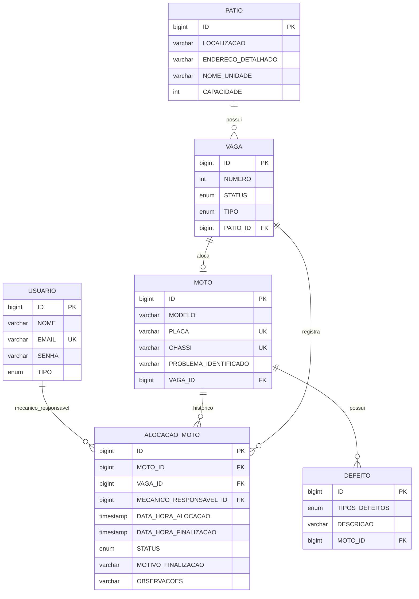

<div align="center">

# 🏍️ GeoSense

<div align="center">
  
  
  
  
</div>

<br>

> 🚀 **Sistema inteligente de gestão de pátios para oficinas mecânicas**  
> Transforme seu espaço de trabalho em um ambiente organizado, eficiente e totalmente digital

[](README.md)
[](LICENSE)

---

## 📋 Índice

- [🎯 Sobre o Projeto](#-sobre-o-projeto)
- [👥 Equipe](#-equipe)
- [🛠️ Tecnologias](#️-tecnologias)
- [🏗️ Arquitetura](#️-arquitetura)
- [🚀 Instalação](#-instalação)
- [🌐 Acesso](#-acesso)
- [📱 Funcionalidades](#-funcionalidades)
- [🗄️ Banco de Dados](#️-banco-de-dados)
- [🧪 Testes](#-testes)
- [📞 Suporte](#-suporte)

---

## 🎯 Sobre o Projeto

### 💡 Visão Geral

O **GeoSense** é uma aplicação web moderna desenvolvida em **Spring Boot** que revoluciona a gestão de pátios em oficinas mecânicas. O sistema oferece controle inteligente de vagas, alocação automatizada de motocicletas, gestão completa de usuários e rastreamento detalhado do histórico de serviços.

### 🎯 Objetivos

<div align="center">

| 🎯 **Gestão Inteligente** | 🔒 **Segurança** | ⚡ **Eficiência** | 📊 **Rastreabilidade** |
|:-------------------------:|:----------------:|:----------------:|:----------------------:|
| Controle automatizado de vagas e alocação de veículos | Sistema robusto de autenticação e autorização | Otimização completa do fluxo de trabalho | Histórico detalhado de alocações e manutenções |

</div>

### ✨ Principais Características

- 🏍️ **Gestão Completa de Motocicletas**: Cadastro, alocação e histórico
- 🅿️ **Sistema Inteligente de Vagas**: Controle automático de ocupação
- 👥 **Gestão de Usuários**: Administradores e mecânicos com permissões específicas
- 📊 **Dashboard Administrativo**: Métricas em tempo real
- 🔒 **Segurança Avançada**: Autenticação e autorização robustas
- 📱 **Interface Responsiva**: Design moderno e intuitivo

---

## 👥 Equipe

<div align="center">

<table>
  <tr>
    <td align="center">
      
    </td>
    <td align="center">
      
    </td>
    <td align="center">
      
    </td>
  </tr>
</table>

</div>

---

## 🛠️ Tecnologias

### 🔧 Stack Principal

<div align="center">

| **Backend** | **Frontend** | **Database** | **Tools** |
|:-----------:|:------------:|:------------:|:---------:|
|  |  |  |  |
|  |  |  |  |
|  |  | |  |
|  | | | |

</div>

### 🏛️ Padrões Arquiteturais

<div align="center">

| 🎨 **MVC** | 🗃️ **Repository** | 📦 **DTO** | ⚙️ **Service Layer** |
|:----------:|:-----------------:|:----------:|:-------------------:|
| Separação clara de responsabilidades | Abstração da camada de acesso a dados | Transferência segura de dados entre camadas | Lógica de negócio centralizada |

</div>

---

## 🏗️ Arquitetura

### 📁 Estrutura do Projeto

```mermaid
graph TD
    A[📁 geosense/Geosense] --> B[⚙️ config/]
    A --> C[🎮 controller/]
    A --> D[📦 dto/]
    A --> E[🗃️ entity/]
    A --> F[💾 repository/]
    A --> G[🔧 service/]
    A --> H[🔒 security/]
    A --> I[✅ validation/]

    B --> B1[AdminInitializer.java]
    B --> B2[FlywayConfig.java]
    B --> B3[SecurityConfig.java]

    C --> C1[AdminApiController.java]
    C --> C2[AlocacaoMotoController.java]
    C --> C3[AuthController.java]
    C --> C4[HomeController.java]
    C --> C5[MotoController.java]
    C --> C6[PatioController.java]
    C --> C7[UsuarioController.java]

    D --> D1[AlocacaoMotoDTO.java]
    D --> D2[CredentialsDTO.java]
    D --> D3[MotoDTO.java]
    D --> D4[UsuarioDTO.java]

    E --> E1[Usuario.java]
    E --> E2[Moto.java]
    E --> E3[Patio.java]
    E --> E4[Vaga.java]
    E --> E5[AlocacaoMoto.java]
    E --> E6[Defeito.java]

    F --> F1[UsuarioRepository.java]
    F --> F2[MotoRepository.java]
    F --> F3[PatioRepository.java]
    F --> F4[AlocacaoMotoRepository.java]

    G --> G1[UsuarioService.java]
    G --> G2[MotoService.java]
    G --> G3[PatioService.java]
    G --> G4[AlocacaoMotoService.java]

    H --> H1[CustomUserDetails.java]
    H --> H2[CustomUserDetailsService.java]
    H --> H3[PasswordEncoderConfig.java]

    I --> I1[SenhaValidator.java]
    I --> I2[ProblemaValidator.java]
    I --> I3[EmailValidator.java]
```



<details>
<summary><strong>📋 Ver estrutura completa</strong></summary>

```
src/main/java/geosense/Geosense/
├── ⚙️ config/                 # Configurações da aplicação
│   ├── AdminInitializer.java
│   ├── FlywayConfig.java
│   └── SecurityConfig.java
├── 🎮 controller/             # Controladores REST/Web
│   ├── AdminApiController.java
│   ├── AlocacaoMotoController.java
│   ├── AuthController.java
│   ├── HomeController.java
│   ├── MotoController.java
│   ├── PatioController.java
│   └── UsuarioController.java
├── 📦 dto/                    # Data Transfer Objects
│   ├── AlocacaoMotoDTO.java
│   ├── CredentialsDTO.java
│   ├── DefeitoDTO.java
│   ├── MotoDTO.java
│   ├── PatioDTO.java
│   ├── UsuarioDTO.java
│   └── ...
├── 🗃️ entity/                 # Entidades JPA
│   ├── Usuario.java
│   ├── Moto.java
│   ├── Patio.java
│   ├── Vaga.java
│   ├── AlocacaoMoto.java
│   ├── Defeito.java
│   └── ...
├── 💾 repository/             # Repositórios de dados
│   ├── UsuarioRepository.java
│   ├── MotoRepository.java
│   ├── PatioRepository.java
│   └── ...
├── 🔧 service/                # Serviços de negócio
│   ├── UsuarioService.java
│   ├── MotoService.java
│   ├── PatioService.java
│   └── ...
├── 🔒 security/               # Configurações de segurança
│   ├── CustomUserDetails.java
│   ├── CustomUserDetailsService.java
│   └── PasswordEncoderConfig.java
└── ✅ validation/             # Validadores customizados
    ├── SenhaValidator.java
    ├── ProblemaValidator.java
    └── ...
```

</details>

---

## 🚀 Instalação

### 📋 Pré-requisitos

<div align="center">

| ☕ **Java** | 🔧 **Maven** | 🗄️ **Oracle DB** | 💻 **IDE** |
|:----------:|:------------:|:----------------:|:----------:|
|  |  |  |  |

</div>

### 1️⃣ Clone o Repositório

```bash
# Clone o repositório
git clone <url-do-repositorio>
cd Geosense

# Verifique se está na pasta correta
ls -la
```

### 2️⃣ Configuração do Banco de Dados

<details>
<summary><strong>🗄️ Oracle Database - Configuração</strong></summary>

```sql
-- Criar usuário (se necessário)
CREATE USER RM555130 IDENTIFIED BY 040506;

-- Conceder permissões
GRANT CONNECT, RESOURCE TO RM555130;
GRANT CREATE SESSION TO RM555130;
GRANT CREATE TABLE TO RM555130;
GRANT CREATE SEQUENCE TO RM555130;

-- Verificar conexão
SELECT USER FROM DUAL;
```

</details>

<details>
<summary><strong>⚙️ Configuração da Aplicação</strong></summary>

Edite o arquivo `src/main/resources/application.properties`:

```properties
# 🗄️ Configurações do Oracle Database
spring.datasource.url=jdbc:oracle:thin:@seu-host:1521/seu-servico
spring.datasource.username=SEU_USUARIO
spring.datasource.password=SUA_SENHA
spring.datasource.driver-class-name=oracle.jdbc.OracleDriver

# 🔧 Configurações JPA/Hibernate
spring.jpa.database-platform=org.hibernate.dialect.OracleDialect
spring.jpa.hibernate.ddl-auto=none
spring.jpa.show-sql=false

# 🌐 Configurações do servidor
server.port=8081
```

</details>

### 3️⃣ Execução da Aplicação

<div align="center">

| 🔧 **Maven** | 💻 **IDE** | 📦 **JAR** | ⚡ **Script** |
|:------------:|:----------:|:----------:|:------------:|
| Via linha de comando | IntelliJ IDEA, Eclipse, VS Code | Executável standalone | Windows Batch |

</div>

<details>
<summary><strong>🔧 Opção 1: Maven - Linha de Comando</strong></summary>

```bash
# 🧹 Limpar e compilar o projeto
mvn clean compile

# 🚀 Executar a aplicação
mvn spring-boot:run

# 📊 Ver logs em tempo real
mvn spring-boot:run -Dspring-boot.run.arguments="--debug"
```

</details>

<details>
<summary><strong>💻 Opção 2: IDE - Ambiente de Desenvolvimento</strong></summary>

### IntelliJ IDEA
1. **File** → **Open** → Selecione a pasta do projeto
2. Aguarde o Maven importar as dependências
3. Navegue até `src/main/java/geosense/Geosense/GeosenseApplication.java`
4. Clique com botão direito → **Run 'GeosenseApplication'**

### Eclipse
1. **File** → **Import** → **Existing Maven Projects**
2. Selecione a pasta do projeto
3. Aguarde o import
4. Clique com botão direito na classe → **Run As** → **Java Application**

### VS Code
1. Abra a pasta do projeto
2. Instale a extensão **Extension Pack for Java**
3. Pressione `Ctrl+Shift+P` → **Java: Run**

</details>

<details>
<summary><strong>📦 Opção 3: JAR - Executável Standalone</strong></summary>

```bash
# 📦 Gerar JAR executável
mvn clean package -DskipTests

# 🚀 Executar JAR
java -jar target/Geosense-0.0.1-SNAPSHOT.jar

# 🔧 Com parâmetros customizados
java -jar target/Geosense-0.0.1-SNAPSHOT.jar --server.port=8082
```

</details>

<details>
<summary><strong>⚡ Opção 4: Script Windows - Execução Rápida</strong></summary>

Execute o arquivo `run.bat` para inicialização automática:

```batch
@echo off
title GeoSense - Sistema de Gestao de Patios
color 0A

echo.
echo  ================================================
echo  🏍️  GeoSense - Sistema de Gestao de Patios
echo  ================================================
echo.
echo  ⚡ Iniciando aplicacao...
echo.

mvn spring-boot:run

echo.
echo  ⏸️  Pressione qualquer tecla para sair...
pause > nul
```

</details>

---

## 🌐 Acesso

### 🚀 Aplicação Online

<div align="center">

[](https://geosense-sprint3-1.onrender.com)

</div>

### 🔗 URLs de Acesso

#### 🌍 **Produção (Render)**

<div align="center">

| 🏠 **Dashboard** | 🔐 **Login** | 📝 **Registro** | ⚙️ **Admin** |
|:---------------:|:------------:|:---------------:|:------------:|
|  |  |  |  |

</div>

#### 💻 **Desenvolvimento Local**

<div align="center">

| 🏠 **Dashboard** | 🔐 **Login** | 📝 **Registro** | ⚙️ **Admin** |
|:---------------:|:------------:|:---------------:|:------------:|
|  |  |  |  |

</div>

### 👥 Contas Padrão

#### 🌍 **Produção (Render)**

<div align="center">

| 👨‍💼 **Administrador** | 👨‍🔧 **Mecânico** |
|:---------------------:|:------------------:|
|  |  |
|  |  |

</div>

#### 💻 **Desenvolvimento Local**

<div align="center">

| 👨‍💼 **Administrador** | 👨‍🔧 **Mecânico** |
|:---------------------:|:------------------:|
|  |  |
|  |  |

</div>

<div align="center">

> ⚠️ **IMPORTANTE**: As credenciais de produção são diferentes das de desenvolvimento local!

</div>

---

## 📱 Funcionalidades

### 🔐 Sistema de Autenticação

<div align="center">

| 🛡️ **Login Seguro** | 📝 **Registro** | 🔑 **Controle de Acesso** | ⏰ **Sessões Seguras** |
|:-------------------:|:---------------:|:-------------------------:|:----------------------:|
| Spring Security integrado | Validação completa de dados | Por tipo de usuário | Timeout automático |

</div>

### 👥 Gestão de Usuários

<div align="center">

| 📋 **CRUD Completo** | 👥 **Tipos de Usuário** | ✅ **Validação** | 🔒 **Criptografia** |
|:--------------------:|:----------------------:|:----------------:|:-------------------:|
| Create, Read, Update, Delete | Administrador e Mecânico | Bean Validation | BCrypt para senhas |

</div>

### 🏢 Gestão de Pátios

<div align="center">

| 🏗️ **Cadastro** | 📊 **Capacidade** | 🤖 **Auto-Geração** | 📱 **Tempo Real** |
|:---------------:|:----------------:|:------------------:|:-----------------:|
| Informações detalhadas | Configuração flexível | Vagas baseadas na capacidade | Status em tempo real |

</div>

### 🏍️ Gestão de Motocicletas

<div align="center">

| 📝 **Cadastro** | ⚠️ **Problemas** | 📚 **Histórico** | 🔍 **Busca** |
|:---------------:|:----------------:|:----------------:|:------------:|
| Dados completos do veículo | Identificação de problemas | Manutenções e alocações | Filtros avançados |

</div>

### 🅿️ Sistema de Alocação

<div align="center">

| 🤖 **Automática** | 📊 **Status** | 📈 **Histórico** | 🔔 **Notificações** |
|:----------------:|:-------------:|:----------------:|:------------------:|
| Vagas disponíveis | Controle em tempo real | Movimentações completas | Mudanças de status |

</div>

### 📊 Dashboard Administrativo

<div align="center">

| 📊 **Métricas** | 📈 **Gráficos** | 📋 **Relatórios** | 🚨 **Alertas** |
|:---------------:|:---------------:|:----------------:|:--------------:|
| Tempo real | Ocupação por pátio | Produtividade por mecânico | Vagas ocupadas há muito tempo |

</div>

---

## 🗄️ Banco de Dados

### 🏗️ Diagrama ER



### 📊 Entidades Principais

<details>
<summary><strong>👤 Usuario - Sistema de Autenticação</strong></summary>

| Campo   | Tipo           | Descrição                         |
|---------|---------------|-----------------------------------|
| `ID`    | `BIGINT`       | 🔑 Identificador único (PK)       |
| `NOME`  | `VARCHAR(100)` | 👤 Nome completo do usuário       |
| `EMAIL` | `VARCHAR(255)` | 📧 Email único para login (UK)    |
| `SENHA` | `VARCHAR(255)` | 🔒 Senha criptografada com BCrypt |
| `TIPO`  | `ENUM`         | 🎭 ADMINISTRADOR ou MECANICO      |

</details>

<details>
<summary><strong>🏢 Patio - Gestão de Locais</strong></summary>

| Campo                | Tipo           | Descrição                     |
|---------------------|---------------|-------------------------------|
| `ID`                | `BIGINT`       | 🔑 Identificador único (PK)   |
| `LOCALIZACAO`        | `VARCHAR(255)` | 📍 Localização do pátio       |
| `ENDERECO_DETALHADO` | `VARCHAR(255)` | 🏠 Endereço completo          |
| `NOME_UNIDADE`       | `VARCHAR(255)` | 🏢 Nome da unidade            |
| `CAPACIDADE`         | `INTEGER`      | 📊 Capacidade máxima de vagas |

</details>

<details>
<summary><strong>🏍️ Moto - Gestão de Veículos</strong></summary>

| Campo                   | Tipo           | Descrição                      |
|------------------------|---------------|--------------------------------|
| `ID`                    | `BIGINT`       | 🔑 Identificador único (PK)    |
| `MODELO`                | `VARCHAR(50)`  | 🏍️ Modelo da motocicleta       |
| `PLACA`                 | `VARCHAR(10)`  | 🚗 Placa única do veículo (UK) |
| `CHASSI`                | `VARCHAR(50)`  | 🔧 Número do chassi (UK)       |
| `PROBLEMA_IDENTIFICADO` | `VARCHAR(255)` | ⚠️ Problema relatado           |
| `VAGA_ID`               | `BIGINT`       | 🔗 Vaga alocada (FK)           |

</details>

<details>
<summary><strong>🅿️ Vaga - Controle de Espaços</strong></summary>

| Campo      | Tipo      | Descrição                              |
|------------|-----------|----------------------------------------|
| `ID`       | `BIGINT`  | 🔑 Identificador único (PK)            |
| `NUMERO`   | `INTEGER` | 🔢 Número da vaga                      |
| `STATUS`   | `ENUM`    | 🟢 LIVRE, 🔴 OCUPADA, 🟡 MANUTENCAO    |
| `TIPO`     | `ENUM`    | 📋 NORMAL, ⭐ PRIORITARIA, 🏆 ESPECIAL |
| `PATIO_ID` | `BIGINT`  | 🔗 Pátio ao qual pertence (FK)         |

</details>

<details>
<summary><strong>📋 AlocacaoMoto - Controle de Alocações</strong></summary>

| Campo                     | Tipo            | Descrição                                           |
|---------------------------|----------------|-----------------------------------------------------|
| `ID`                      | `BIGINT`        | 🔑 Identificador único (PK)                         |
| `MOTO_ID`                 | `BIGINT`        | 🏍️ Motocicleta alocada (FK)                         |
| `VAGA_ID`                 | `BIGINT`        | 🅿️ Vaga ocupada (FK)                                |
| `MECANICO_RESPONSAVEL_ID` | `BIGINT`        | 👨‍🔧 Mecânico responsável (FK)                        |
| `DATA_HORA_ALOCACAO`      | `TIMESTAMP`     | ⏰ Timestamp da alocação                            |
| `DATA_HORA_FINALIZACAO`   | `TIMESTAMP`     | ⏱️ Timestamp da finalização                         |
| `STATUS`                  | `ENUM`          | 🔄 ATIVA, ➡️ REALOCADA, ✅ FINALIZADA, ❌ CANCELADA |
| `MOTIVO_FINALIZACAO`      | `VARCHAR(500)`  | 📝 Motivo da finalização                            |
| `OBSERVACOES`             | `VARCHAR(1000)` | 📄 Observações adicionais                           |

</details>

---

## 🧪 Testes

### 📊 Estrutura de Testes

```
src/test/java/geosense/Geosense/
└── GeosenseApplicationTests.java
```

### 🚀 Execução de Testes

```bash
# Executar todos os testes
mvn test

# Executar testes com relatório
mvn test jacoco:report

# Executar testes específicos
mvn test -Dtest=NomeDoTeste
```

### 📈 Cobertura de Testes

- **Testes Unitários**: Validação de lógica de negócio
- **Testes de Integração**: Validação de endpoints
- **Testes de Segurança**: Validação de autenticação
- **Testes de Interface**: Validação de templates

---

## 🚀 Deploy e Configuração

### ☁️ Deploy no Render

O GeoSense está deployado no [Render](https://render.com) e está disponível em produção:

#### 🔗 **URL da Aplicação**

```
https://geosense-sprint3-1.onrender.com
```

#### ⚙️ **Configurações do Deploy**

<div align="center">

| 🏗️ **Build Command** | 📦 **Start Command** | 🌍 **Environment** |
|:--------------------:|:--------------------:|:------------------:|
|  |  |  |

</div>

#### 📋 **Variáveis de Ambiente (Produção)**

```properties
# 🗄️ Configurações do Banco de Dados (Render)
DATABASE_URL=jdbc:oracle:thin:@[host]:[port]/[service]
DB_USERNAME=[usuario_producao]
DB_PASSWORD=[senha_producao]

# 🌐 Configurações do Servidor
SERVER_PORT=10000
SPRING_PROFILES_ACTIVE=production

# 🔧 Configurações JPA
SPRING_JPA_HIBERNATE_DDL_AUTO=none
SPRING_JPA_SHOW_SQL=false
```

#### 🔄 **Processo de Deploy Automático**

1. **Push para repositório** → Trigger automático
2. **Build** → Maven package
3. **Deploy** → Render automaticamente faz o deploy
4. **Health Check** → Verificação de saúde da aplicação

#### 📊 **Monitoramento**

- **Uptime**: Monitorado 24/7
- **Logs**: Disponíveis no dashboard do Render
- **Métricas**: CPU, memória e rede
- **Scaling**: Automático baseado na demanda

### 🛠️ Configuração Local vs Produção

<div align="center">

| Aspecto     | 💻 Local                | 🌍 Produção                               |
|-------------|------------------------|-------------------------------------------|
| **URL**     | `http://localhost:8081` | `https://geosense-sprint3-1.onrender.com` |
| **Banco**   | Oracle Local/Cloud      | Oracle Cloud                              |
| **Porta**   | 8081                    | 10000 (Render)                            |
| **Profile** | `default`               | `production`                              |
| **SSL**     | ❌ HTTP                 | ✅ HTTPS                                  |
| **Domain**  | localhost               | onrender.com                              |

</div>

---

## 📱 Interface do Usuário

### ✨ Características da UI

- **Design Responsivo**: Adaptável a diferentes dispositivos
- **Tema Moderno**: Interface elegante e intuitiva
- **Componentes Interativos**: Cards, modais e formulários
- **Feedback Visual**: Mensagens de sucesso/erro
- **Navegação Intuitiva**: Menu lateral e breadcrumbs

### 🛠️ Tecnologias Frontend

- **Thymeleaf**: Template engine server-side
- **Bootstrap 5**: Framework CSS
- **Font Awesome**: Ícones
- **JavaScript Vanilla**: Interatividade
- **CSS3**: Estilização customizada

---

## 🛠️ Desenvolvimento

### 🔧 Comandos Úteis

```bash
# Limpar e compilar
mvn clean compile

# Executar com profile específico
mvn spring-boot:run -Dspring-boot.run.profiles=dev

# Verificar dependências
mvn dependency:tree

# Analisar código
mvn spotbugs:check

# Formatar código
mvn formatter:format
```

### 🌿 Estrutura de Branches

- **main**: Código de produção
- **develop**: Desenvolvimento ativo
- **feature/\***: Novas funcionalidades
- **hotfix/\***: Correções urgentes

---

## 🚨 Troubleshooting

### ❗ Problemas Comuns

#### 1. Erro de Conexão com Banco

```
Caused by: java.sql.SQLException: Listener refused the connection
```

**Solução**: Verifique se o Oracle está rodando e as credenciais estão corretas.

#### 2. Porta em Uso

```
Web server failed to start. Port 8081 was already in use.
```

**Solução**: Altere a porta no `application.properties` ou mate o processo.

#### 3. Erro de Migração Flyway

```
FlywayException: Validate failed
```

**Solução**: Execute `mvn flyway:repair` ou limpe o banco.

### 🔍 Logs de Debug

```properties
# Habilitar logs detalhados
logging.level.org.springframework.web=DEBUG
logging.level.org.springframework.security=DEBUG
logging.level.org.hibernate.SQL=DEBUG
```

---

## 📚 Documentação Adicional

### 🔌 APIs Disponíveis

#### Usuários
- `GET /usuarios` - Listar usuários
- `POST /usuarios` - Criar usuário
- `PUT /usuarios/{id}` - Atualizar usuário
- `DELETE /usuarios/{id}` - Deletar usuário

#### Motos
- `GET /motos` - Listar motocicletas
- `POST /motos` - Cadastrar moto
- `GET /motos/{id}` - Buscar moto específica
- `PUT /motos/{id}` - Atualizar moto

#### Alocações
- `GET /alocacoes` - Listar alocações
- `POST /alocacoes` - Criar alocação
- `PUT /alocacoes/{id}/finalizar` - Finalizar alocação

### 🗄️ Banco de Dados

#### Migrações Flyway
- `V1__create_tables.sql` - Criação das tabelas base
- `V2__constraints_and_indexes.sql` - Constraints e índices
- `V3__seed_data.sql` - Dados iniciais
- `V15__fix_existing_alocacao_data.sql` - Correções de dados

### 📏 Padrões de Código

- **Java**: Seguir convenções do Spring Boot
- **SQL**: Usar maiúsculas para palavras-chave
- **Commits**: Mensagens descritivas em português
- **Testes**: Cobertura mínima de 80%

---

## 📄 Licença

Este projeto está sob a licença MIT. Veja o arquivo [LICENSE](LICENSE) para mais detalhes.

---

## 📞 Suporte

Para suporte técnico ou dúvidas sobre o projeto:

- **Email**: geosense@fiap.com.br
- **Documentação**: [Wiki do Projeto](wiki-url)
- **Issues**: [GitHub Issues](issues-url)

---

<div align="center">

## 🏆 Desenvolvido pela equipe GeoSense

<table align="center">
  <tr>
    <td align="center">
      
    </td>
    <td align="center">
      
    </td>
    <td align="center">
      
    </td>
  </tr>
</table>

---

### 🎓 FIAP - Faculdade de Informática e Administração Paulista

<div align="center">


</div>

---

### 🚀 _Transformando a gestão de pátios através da tecnologia_


</div>

---
